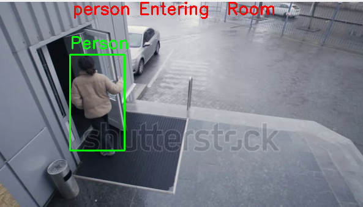
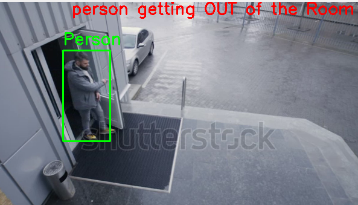

# 📹 CCTV Video Compression for Smart Surveillance  
**Efficiently Extract and Compile Key Moments in Surveillance Footage**  

## 📝 Overview  
Traditional CCTV systems generate lengthy recordings, making it tedious to review footage. This project solves that problem by **intelligently compressing video** – storing frames only when someone **enters or exits** a room. Using these frames, it reconstructs a condensed video, allowing users to quickly identify important moments without watching hours of footage.  

## 🚀 Features  
✅ **Motion-Based Frame Extraction** – Captures frames only when human movement is detected at entry/exit points.




✅ **Smart Video Reconstruction** – Generates a **shorter** video containing only relevant events. Generated a shorter video of only four seconds (selected_frames_video.mp4) from a eighteen second video(entry_room.webm).

✅ **Optimized Storage Usage** – Significantly reduces video size without missing crucial details.  
✅ **Faster Footage Review** – Helps users quickly navigate through key moments.  

## 🛠️ Tech Stack 
- **Python** – Core programming language for video processing.  
- **OpenCV** – For motion detection, frame extraction, and video reconstruction.  
- **YOLOv11** – For advanced human detection.  

## 📦 Installation & Setup  
### 1️⃣ Clone this repository  
```bash
git clone https://github.com/yourusername/cctv-video-compression.git
cd cctv-video-compression
